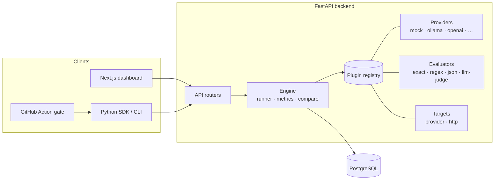

<div align="center">

# Litmus

### Ship AI you can trust.

Open-source, self-hostable platform to **evaluate**, **red-team**, and **monitor** AI
systems — LLMs, RAG, agents, and vision — before and after production.
**Runs with no API key.**

[](https://github.com/oussamaelbourakadi/litmus/actions/workflows/ci.yml)
[](https://github.com/oussamaelbourakadi/litmus/actions/workflows/litmus-eval.yml)
[](./LICENSE)


**Live demo:** _dashboard_ · _docs_ — add your URLs after deploying ([`docs/DEPLOY.md`](./docs/DEPLOY.md))

</div>

---

> **Status:** Phase 1 — **Evaluate** — is complete: engine, metrics with confidence
> intervals, run comparison / regression gate, dashboard, and an SDK + CLI + GitHub
> Action. Red-Team (OWASP LLM), adversarial Vision, and Monitor are on the roadmap.

<!-- Demo media: record short GIFs of the dashboard and drop them in docs/media/, then uncomment:

-->

## Why Litmus

Litmus is a **professional-grade demonstrator** that coexists with tools like
Promptfoo, DeepEval, and Langfuse — not a clone. Its differentiation:

- **Statistical rigor** — bootstrap confidence intervals on every aggregate, fixed seeds, reproducible runs. No invented metrics.
- **Runs with no API key** — mock + local (Ollama) providers, so anyone can clone and try it.
- **A real CI gate** — an SDK + CLI + GitHub Action that fails the build on regression.
- **Clean plugin architecture** — a provider, evaluator, target (and later attack) is a single class + a decorator. Adding a capability never touches the core.
- **Adversarial vision / multimodal module** (roadmap) — largely absent from text-only competitors.

## Three pillars, aligned with the lifecycle

```
┌─────────────────┐    ┌─────────────────┐    ┌─────────────────┐
│    EVALUATE     │    │    RED-TEAM     │    │    MONITOR      │
│ (before deploy) │    │ (before deploy) │    │ (after deploy)  │
│                 │    │                 │    │                 │
│ Metrics + CI    │    │ OWASP LLM Top10 │    │ Live traces     │
│ Comparison      │    │ Adversarial     │    │ Drift + alerts  │
│ Regression gate │    │ vision attacks  │    │ Trace-to-test   │
│   ✅ shipped    │    │   ⏳ roadmap    │    │   ⏳ roadmap    │
└─────────────────┘    └─────────────────┘    └─────────────────┘
```

## Architecture



## Evaluate — what ships today

- **Providers:** Mock (deterministic, seeded), Ollama (local, no key), OpenAI / Anthropic / Mistral (optional, env-gated).
- **Evaluators:** ExactMatch, RegexMatch, JsonSchema, LLMJudge (rubric → JSON verdict) + judge calibration (agreement, Cohen's kappa).
- **Engine:** per-case error isolation, AND verdict, repeats; metrics = success rate **with bootstrap CI**, latency P50/P95, cost (price table), per-evaluator pass rates.
- **Compare:** aggregate deltas + per-case regressions + an absolute/relative **threshold verdict**.
- **Dashboard:** projects → datasets (CSV upload) → runs → metric cards + per-case table → comparison with highlighted regressions.
- **SDK + CLI + GitHub Action:** local, serverless runs that **fail CI on regression**.

## Quickstart (5 minutes, no API key)

```bash
git clone https://github.com/oussamaelbourakadi/litmus.git
cd litmus
docker compose up --build
```

- API: http://localhost:8000 (Swagger `/docs`, health `/health`)
- Dashboard: http://localhost:3000

## CLI / SDK / GitHub Action

**CLI** (serverless, exits non-zero on regression):

```bash
uv pip install ./sdk
litmus init                       # scaffold litmus.yaml + a demo target
litmus run --config litmus.yaml   # evaluate and gate on regressions
```

**SDK** (run an eval in ~10 lines):

```python
from litmus import Case, ExactMatch, run_local

cases = [Case(input="capital of France?", expected="Paris")]
result = run_local(cases, lambda prompt: "Paris", [ExactMatch()])
print(result.success_rate, result.ci_low, result.ci_high)
```

**GitHub Action** — add the [`litmus-eval.yml`](./.github/workflows/litmus-eval.yml)
workflow; it installs the SDK and fails the build when the success rate drops
below your baseline.

## Extending Litmus (plugin architecture)

Adding a capability is always the same shape — write a class, register it:

```python
from app.providers import ModelProvider, provider_registry

@provider_registry.register("my-provider")
class MyProvider(ModelProvider):
    name = "my-provider"
    async def generate(self, prompt, config):
        ...
```

The same pattern applies to evaluators (`evaluator_registry`) and targets
(`target_registry`). The engine discovers plugins by name; the core never changes.

## Repository structure

```
litmus/
├── backend/     FastAPI · SQLAlchemy 2 async · Alembic · engine · plugin registry
├── frontend/    Next.js (App Router) · TypeScript strict · Tailwind dashboard
├── sdk/         litmus-sdk — local runner + Typer CLI + CI gate
├── examples/    demo target, dataset, litmus.yaml, SDK quickstart
├── docs/        DEPLOY.md · PORTFOLIO_BLURB.md
├── docker-compose.yml
└── .github/workflows/   ci.yml · litmus-eval.yml
```

## Roadmap

| Phase | Pillar | Status |
|-------|--------|--------|
| 1 | **Evaluate** — engine, metrics, comparison, dashboard, SDK/CLI, CI gate | ✅ shipped |
| 2 | **Red-Team (LLM)** — OWASP LLM Top 10 attacks, defenses, report | ⏳ planned |
| 3 | **Adversarial Vision** — FGSM/PGD/patch, face-recognition showcase | ⏳ planned |
| 4 | **Monitor** — traces, online eval, drift, alerts, trace-to-test | ⏳ planned |
| 5 | **Product** — auth, multi-project, docs, landing | ⏳ planned |

Contributions welcome — see the issue templates and PR checklist.

## Deployment

Backend on Render (Docker + managed Postgres), frontend on Vercel — see
[`docs/DEPLOY.md`](./docs/DEPLOY.md). Runs with no API key.

## Author

**Oussama El Bourakadi** — [github.com/oussamaelbourakadi](https://github.com/oussamaelbourakadi)

## License

[MIT](./LICENSE)
