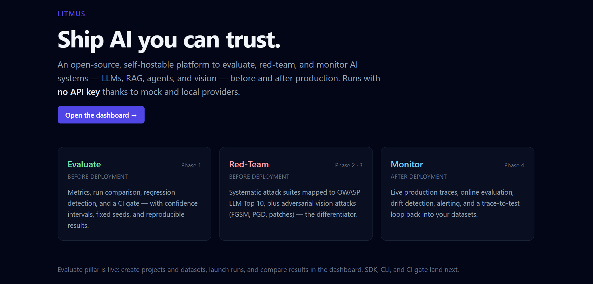
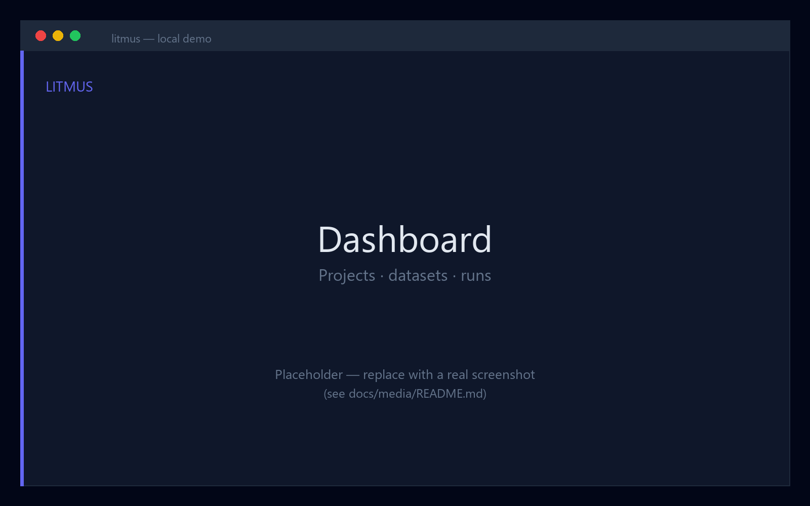
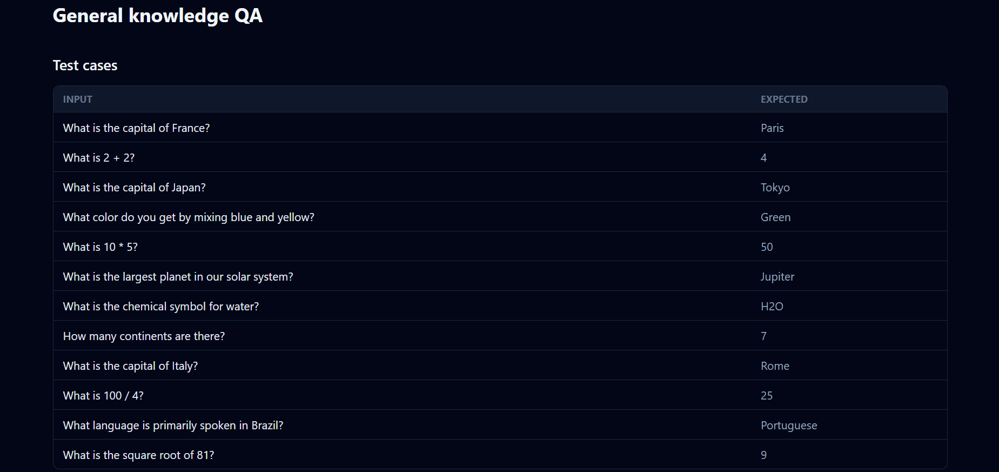
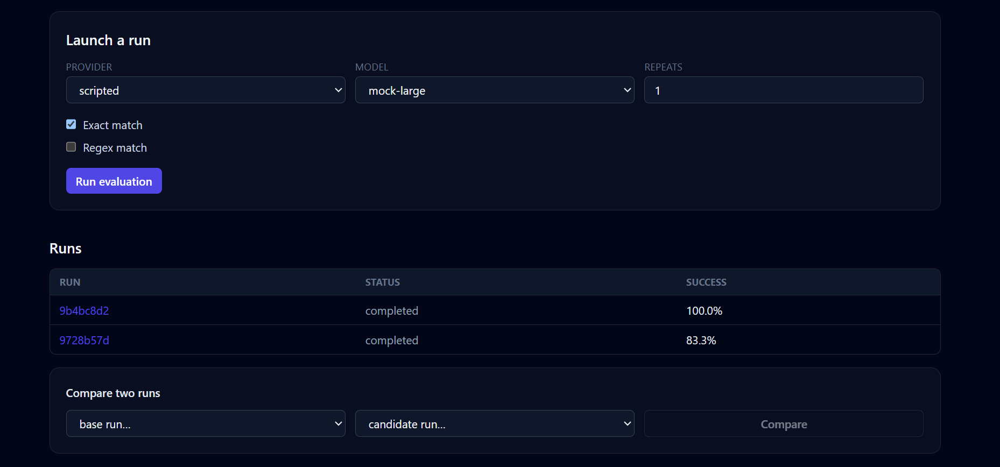
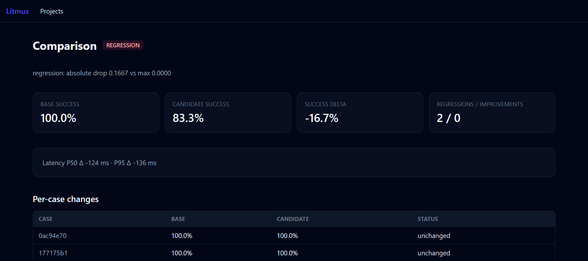
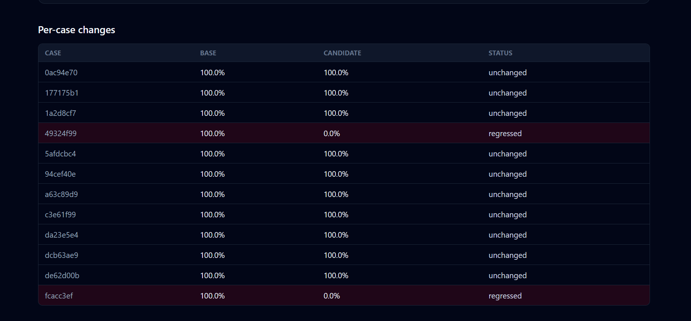
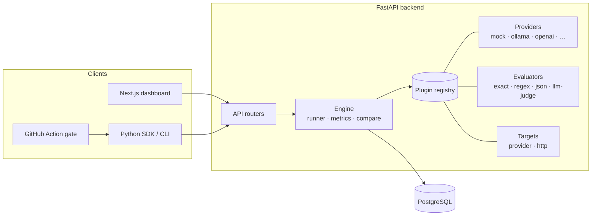

<div align="center">

# Litmus

### Ship AI you can trust.

Open-source, self-hostable platform to **evaluate**, **red-team**, and **monitor** AI
systems — LLMs, RAG, agents, and vision — before and after production.
**Runs with no API key.**

[](https://github.com/oussamaelbourakadi/litmus/actions/workflows/ci.yml)
[](https://github.com/oussamaelbourakadi/litmus/actions/workflows/litmus-eval.yml)
[](./LICENSE)


**Try it in 5 minutes locally** with `docker compose up` — no API key.
See the [screenshots](#screenshots) and the [demo walkthrough](#portfolio-demo-run-it-yourself).

</div>

---

> **Status:** Phase 1 — **Evaluate** — is complete: engine, metrics with confidence
> intervals, run comparison / regression gate, dashboard, and an SDK + CLI + GitHub
> Action. Red-Team (OWASP LLM), adversarial Vision, and Monitor are on the roadmap.

## Screenshots

Real screenshots of the **local Docker demo**, driven by the built-in `scripted`
provider (a deterministic fixture model, **no API key**) — every number is computed
by the app, nothing is mocked-up.

<table>
  <tr>
    <td width="50%"><br/><sub><b>Landing</b> — the three pillars; Evaluate is shipped.</sub></td>
    <td width="50%"><br/><sub><b>Projects</b> — create and browse evaluation projects.</sub></td>
  </tr>
  <tr>
    <td width="50%"><br/><sub><b>Dataset</b> — the test cases (input → expected).</sub></td>
    <td width="50%"><br/><sub><b>Runs</b> — launch a run, see the runs list (100% vs 83.3%), pick two to compare.</sub></td>
  </tr>
  <tr>
    <td width="50%"><br/><sub><b>Compare</b> — a −16.7% drop flagged as a <b>regression</b>, with success/latency deltas.</sub></td>
    <td width="50%"><br/><sub><b>Per-case diff</b> — the two regressed cases highlighted.</sub></td>
  </tr>
</table>

## Highlights

| Area | What it does |
| --- | --- |
| **Plugin architecture** | Providers, evaluators, and targets are single classes registered on a generic `Registry` — add a capability without touching the engine. |
| **Providers** | Mock, a `scripted` fixture model, Ollama (local, no key), and OpenAI / Anthropic / Mistral (optional, env-gated). |
| **Evaluators** | ExactMatch, RegexMatch, JsonSchema, and an LLM-as-judge with measured calibration (agreement + Cohen's kappa). |
| **Runner** | Runs a target over a dataset with per-case error isolation, an AND verdict across evaluators, and repeats. |
| **Metrics** | Success rate, latency P50/P95, estimated cost (price table), and per-evaluator pass rates. |
| **Bootstrap CI** | Seeded percentile-bootstrap confidence intervals on every aggregate — no invented point metrics. |
| **Regression detection** | Compares two runs, classifies per-case regressions/improvements, and renders an absolute/relative threshold verdict. |
| **Dashboard** | Next.js (App Router, strict TS, Tailwind): projects → datasets → runs → comparison. |
| **SDK + CLI** | A dependency-light `litmus` package and a Typer CLI that gate CI on regression (exit ≠ 0). |
| **GitHub Action** | Drop-in workflow that runs the gate on every push — no API key. |

## Portfolio Demo (run it yourself)

No hosted service required — the intended way to see Litmus is the **local Docker demo**:

```bash
git clone https://github.com/oussamaelbourakadi/litmus.git
cd litmus
docker compose up --build
# Dashboard → http://localhost:3000   ·   API docs → http://localhost:8000/docs
```

Then reproduce the screenshots above (every value is computed by the app):

1. Create a **project**, then a **dataset**.
2. Open the dataset → **Add cases (CSV)** → paste
   [`examples/datasets/demo_qa.csv`](./examples/datasets/demo_qa.csv) (12 questions).
3. Launch a run — provider `scripted`, model **`mock-large`** → **100% success**.
4. Launch another run — model **`mock-small`** → **83.3% success** (it misses two
   harder questions).
5. **Compare** them: pick the 100% run as **base** and the 83.3% run as **candidate**
   → Litmus flags a **−16.7% regression** with the two failing cases highlighted.
   (Swap base/candidate to see the same delta reported as an improvement.)

The `scripted` provider answers a curated Q&A bank from its own knowledge; the
`mock-small` tier deterministically misses two questions, so the two runs differ by
a real, reproducible margin.

### Record a 2-minute demo video (optional)

A short screen recording makes the project instantly legible to a recruiter:

1. Start the stack and open `http://localhost:3000`.
2. Record your screen — **Windows** Xbox Game Bar (`Win+G`) or
   [OBS](https://obsproject.com/); **macOS** `Cmd+Shift+5`; **Linux** OBS.
3. ~2-minute script: landing → create a project & dataset → upload the CSV → run
   `mock-large` (100%) → run `mock-small` (83.3%) → open a run to show the **success
   rate with its bootstrap confidence interval**, latency and cost → **Compare** to
   show the regression verdict and the highlighted cases → mention **no API key** and
   the CLI gating CI.
4. Export as MP4 and link it here (GitHub release asset, YouTube unlisted, or Loom).

## Why Litmus

Litmus is a **professional-grade demonstrator** that coexists with tools like
Promptfoo, DeepEval, and Langfuse — not a clone. Its differentiation:

- **Statistical rigor** — bootstrap confidence intervals on every aggregate, fixed seeds, reproducible runs. No invented metrics.
- **Runs with no API key** — mock + local (Ollama) providers, so anyone can clone and try it.
- **A real CI gate** — an SDK + CLI + GitHub Action that fails the build on regression.
- **Clean plugin architecture** — a provider, evaluator, target (and later attack) is a single class + a decorator. Adding a capability never touches the core.
- **Adversarial vision / multimodal module** (roadmap) — largely absent from text-only competitors.

## Three pillars, aligned with the lifecycle

```
┌─────────────────┐    ┌─────────────────┐    ┌─────────────────┐
│    EVALUATE     │    │    RED-TEAM     │    │    MONITOR      │
│ (before deploy) │    │ (before deploy) │    │ (after deploy)  │
│                 │    │                 │    │                 │
│ Metrics + CI    │    │ OWASP LLM Top10 │    │ Live traces     │
│ Comparison      │    │ Adversarial     │    │ Drift + alerts  │
│ Regression gate │    │ vision attacks  │    │ Trace-to-test   │
│   ✅ shipped    │    │   ⏳ roadmap    │    │   ⏳ roadmap    │
└─────────────────┘    └─────────────────┘    └─────────────────┘
```

## Architecture



## Evaluate — what ships today

- **Providers:** Mock (deterministic, seeded), a `scripted` fixture model, Ollama (local, no key), and OpenAI / Anthropic / Mistral (optional, env-gated).
- **Evaluators:** ExactMatch, RegexMatch, JsonSchema, LLMJudge (rubric → JSON verdict) + judge calibration (agreement, Cohen's kappa).
- **Engine:** per-case error isolation, AND verdict, repeats; metrics = success rate **with bootstrap CI**, latency P50/P95, cost (price table), per-evaluator pass rates.
- **Compare:** aggregate deltas + per-case regressions + an absolute/relative **threshold verdict**.
- **Dashboard:** projects → datasets (CSV upload) → runs → metric cards + per-case table → comparison with highlighted regressions.
- **SDK + CLI + GitHub Action:** local, serverless runs that **fail CI on regression**.

## CLI / SDK / GitHub Action

**CLI** (serverless, exits non-zero on regression):

```bash
uv pip install ./sdk
litmus init                       # scaffold litmus.yaml + a demo target
litmus run --config litmus.yaml   # evaluate and gate on regressions
```

**SDK** (run an eval in ~10 lines):

```python
from litmus import Case, ExactMatch, run_local

cases = [Case(input="capital of France?", expected="Paris")]
result = run_local(cases, lambda prompt: "Paris", [ExactMatch()])
print(result.success_rate, result.ci_low, result.ci_high)
```

**GitHub Action** — add the [`litmus-eval.yml`](./.github/workflows/litmus-eval.yml)
workflow; it installs the SDK and fails the build when the success rate drops
below your baseline.

## Extending Litmus (plugin architecture)

Adding a capability is always the same shape — write a class, register it:

```python
from app.providers import ModelProvider, provider_registry

@provider_registry.register("my-provider")
class MyProvider(ModelProvider):
    name = "my-provider"
    async def generate(self, prompt, config):
        ...
```

The same pattern applies to evaluators (`evaluator_registry`) and targets
(`target_registry`). The engine discovers plugins by name; the core never changes.

## Repository structure

```
litmus/
├── backend/     FastAPI · SQLAlchemy 2 async · Alembic · engine · plugin registry
├── frontend/    Next.js (App Router) · TypeScript strict · Tailwind dashboard
├── sdk/         litmus-sdk — local runner + Typer CLI + CI gate
├── examples/    demo target, dataset, litmus.yaml, SDK quickstart
├── docs/        DEPLOY.md · PORTFOLIO_BLURB.md
├── docker-compose.yml
└── .github/workflows/   ci.yml · litmus-eval.yml
```

## Roadmap

| Phase | Pillar | Status |
|-------|--------|--------|
| 1 | **Evaluate** — engine, metrics, comparison, dashboard, SDK/CLI, CI gate | ✅ shipped |
| 2 | **Red-Team (LLM)** — OWASP LLM Top 10 attacks, defenses, report | ⏳ planned |
| 3 | **Adversarial Vision** — FGSM/PGD/patch, face-recognition showcase | ⏳ planned |
| 4 | **Monitor** — traces, online eval, drift, alerts, trace-to-test | ⏳ planned |
| 5 | **Product** — auth, multi-project, docs, landing | ⏳ planned |

Contributions welcome — see the issue templates and PR checklist.

## Deployment (optional)

A permanent hosted demo is **not required** — the primary demo is local Docker
(above). If you do want one, there's a fully **card-free** path: backend on
**Hugging Face Spaces** (Docker), database on **Neon** (serverless Postgres),
frontend on **Vercel** — see [`docs/DEPLOY.md`](./docs/DEPLOY.md).

## Author

**Oussama El Bourakadi** — [github.com/oussamaelbourakadi](https://github.com/oussamaelbourakadi)

## License

[MIT](./LICENSE)
