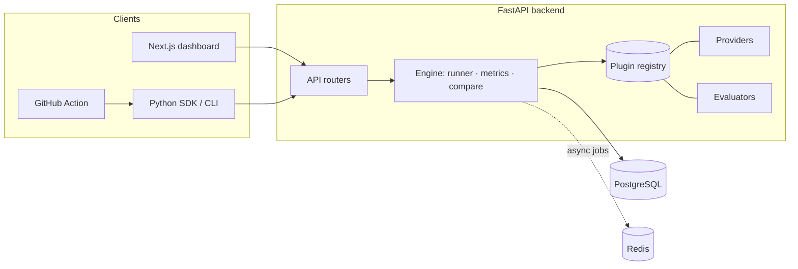

<div align="center">

# Litmus

### Ship AI you can trust.

Open-source, self-hostable platform to **evaluate**, **red-team**, and **monitor** AI
systems — LLMs, RAG, agents, and vision — before and after production.

[](https://github.com/oussamaelbourakadi/litmus/actions/workflows/ci.yml)
[](./LICENSE)


</div>

---

> **Status:** Phase 1.0 (foundation) — the monorepo, backend/DB, plugin architecture,
> dashboard shell, and CI are in place. The evaluation engine, dashboard, SDK, and CI
> gate land in Phases 1.1–1.7. A live demo URL will be published with Phase 1.7.

## Why Litmus

Litmus is a **professional-grade demonstrator** that coexists with tools like
Promptfoo, DeepEval, and Langfuse — not a clone. Its differentiation:

- **Adversarial vision / multimodal module** — largely absent from text-only competitors.
- **Statistical rigor** — bootstrap confidence intervals, fixed seeds, reproducible runs. No invented metrics.
- **Runs with no API key** — mock + local (Ollama) providers, so anyone can clone and try it.
- **SDK + CLI + GitHub Action** — a real developer tool, not just a UI.
- **Clean plugin architecture** — an evaluator, an attack, a provider, or a connector is a single class. Adding a capability never touches the core.

## Three pillars, aligned with the lifecycle

```
┌─────────────────┐    ┌─────────────────┐    ┌─────────────────┐
│    EVALUATE     │    │    RED-TEAM     │    │    MONITOR      │
│ (before deploy) │    │ (before deploy) │    │ (after deploy)  │
│                 │    │                 │    │                 │
│ Metrics + CI    │    │ OWASP LLM Top10 │    │ Live traces     │
│ Comparison      │    │ Adversarial     │    │ Drift + alerts  │
│ Regression gate │    │ vision attacks  │    │ Trace-to-test   │
└─────────────────┘    └─────────────────┘    └─────────────────┘
```

## Architecture



## Quickstart (5 minutes, no API key)

```bash
git clone https://github.com/oussamaelbourakadi/litmus.git
cd litmus
docker compose up --build
```

- Backend API: http://localhost:8000 (Swagger at `/docs`, health at `/health`)
- Dashboard: http://localhost:3000

## Local development

**Backend** (Python 3.12 via [uv](https://docs.astral.sh/uv/)):

```bash
cd backend
uv sync
uv run pytest            # in-memory SQLite, no network, no key
uv run uvicorn app.main:app --reload
```

**Frontend** (Node 24):

```bash
cd frontend
npm install
npm run dev
```

## Repository structure

```
litmus/
├── backend/     FastAPI · SQLAlchemy 2 async · Alembic · plugin registry
│   └── app/
│       ├── api/         routers (health, …)
│       ├── core/        generic plugin Registry
│       ├── db/          base, mixins, async session
│       ├── models/      ORM models (Project, …)
│       ├── providers/   ModelProvider interface + registry
│       └── evaluators/  Evaluator interface + registry
├── frontend/    Next.js (App Router) · TypeScript strict · Tailwind
├── docker-compose.yml
└── .github/workflows/ci.yml
```

## Extending Litmus (plugin architecture)

Adding a capability is always the same shape — write a class, register it:

```python
from app.providers import ModelProvider, provider_registry

@provider_registry.register("my-provider")
class MyProvider(ModelProvider):
    name = "my-provider"
    async def generate(self, prompt, config):
        ...
```

The engine discovers plugins by name; the core never changes.

## Roadmap

| Phase | Pillar | Status |
|-------|--------|--------|
| 1 | **Evaluate** — engine, metrics, comparison, dashboard, SDK/CLI, CI gate | 🚧 1.0 done |
| 2 | **Red-Team (LLM)** — OWASP LLM Top 10 attacks, defenses, report | ⏳ planned |
| 3 | **Adversarial Vision** — FGSM/PGD/patch, face-recognition showcase | ⏳ planned |
| 4 | **Monitor** — traces, online eval, drift, alerts, trace-to-test | ⏳ planned |
| 5 | **Product** — auth, multi-project, docs, landing | ⏳ planned |

Contributions welcome — see the issue templates and PR checklist.

## Author

**Oussama El Bourakadi** — [github.com/oussamaelbourakadi](https://github.com/oussamaelbourakadi)

## License

[MIT](./LICENSE)
